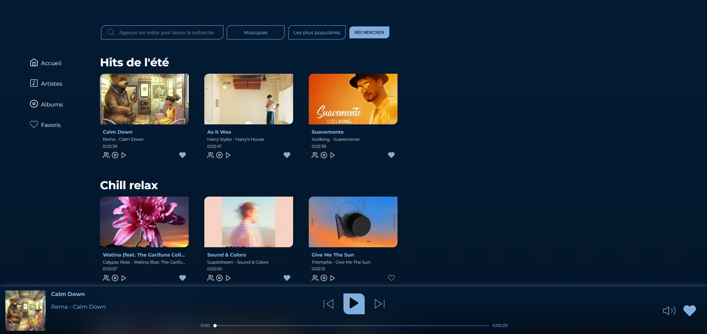
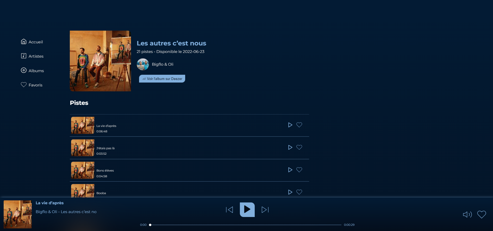
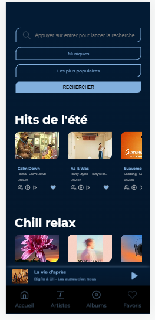
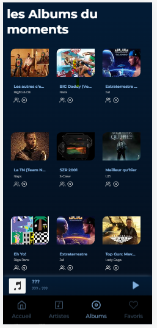

##DeezWeb

Realiser avec node js pour effectuer les appels apis depuis le serveur

Pour la partie client React et Redux pour la gestions des apis pour faciliter la manipulation des données aux differentes componsants.

Pour le style j'ai utilisé styled components et css

###Pour démarrer l'aplication

#### `npm  install`
Pour installer les modules et les dependance du serveur

#### `npm  run install-client`
Cette commande permet d'installer les modules et les dependances de la partie client

 #### `npm run dev-server `
 Pour démarrer l'application ceci demarre le serveur et aussi le client.

### Aperçu 

